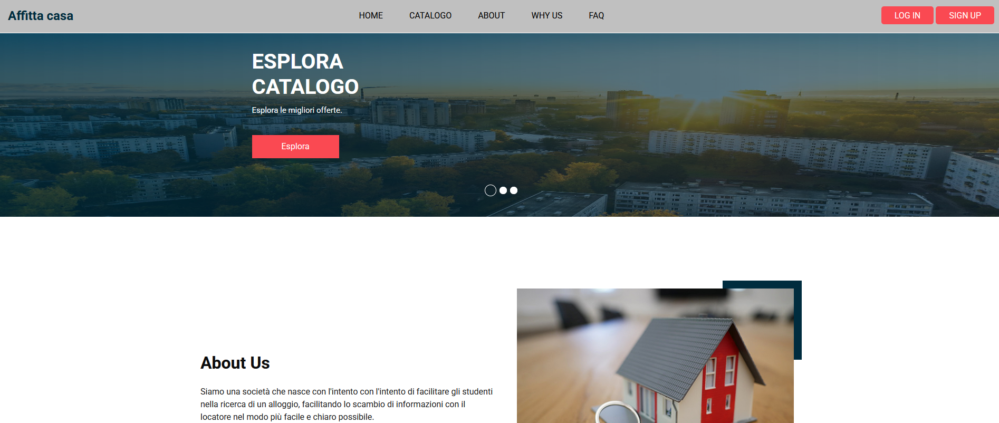

<h1 align="center">Web Technologies (Tecnologie Web) Course Project</h1>

  
  
  
  
  
  
  

  <i>Platform for managing listings, user roles, messaging, and booking requests.</i>

  

<h2>Website Structure</h2>

The website is organized into four navigation levels, all accessible through a shared navbar.  
After login, users are redirected to the homepage corresponding to their assigned level.

<ul>
  <li><b>Level 1:</b> Public pages (homepage, catalog preview)</li>
  <li><b>Level 2:</b> Registered users (basic features, messaging)</li>
  <li><b>Level 3:</b> Locatario (tenant): filters, bookings, messaging</li>
  <li><b>Level 4:</b> Locatore / Admin: listing management, booking requests</li>
</ul>

<h2>Adopted Solutions</h2>

<ul>
  <li><b>User Homepage:</b> single template with conditional rendering based on user type; modular header/footer; dynamic carousel</li>
  <li><b>Listing Management (Locatore):</b> add/edit/delete listings; view requests; accept/reject; contact users</li>
  <li><b>Catalog:</b> single page with behavior adapted to each role (guest, tenant, landlord, admin)</li>
  <li><b>Admin Statistics:</b> filtered data by listing type and date range</li>
</ul>

<h2>Tech Stack</h2>

<ul>
  <li><b>Frontend:</b> HTML5, CSS3, JavaScript (ES6)</li>
  <li><b>Backend:</b> PHP 7.4, Laravel</li>
  <li><b>Database:</b> MySQL (6-table relational model)</li>
  <li><b>Architecture:</b> MVC</li>
</ul>

<h2>Authors</h2>

<ul>
  <li>Michele Vigliotta</li>
  <li>Filippo Montagnoli</li>
  <li>Marco Pasquale Martino</li>
</ul>

<i>University project developed for the Web Technologies course.</i>

